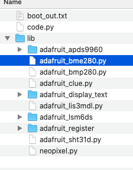

## CircuitPython on CLUE
[CircuitPython](https://github.com/adafruit/circuitpython) is a derivative of [MicroPython](https://micropython.org/) designed to simplify experimentation and education on low-cost microcontrollers


See 
- [Adafruit CircuitPython](https://learn.adafruit.com/adafruit-clue/circuitpython)
- [Circuit Python doc](https://circuitpython.readthedocs.io/projects/clue/en/latest/api.html)

The Mu Editor is a good fit for this CLUE board.

Copy the files in the directory into `code.py` (see the doc about that). Save it, and you should see the code running.


From `adafruit-circuitpython-bundle-py-20210423`, copy into the `lib` folder:  


Then you can run:
```python
# SPDX-FileCopyrightText: 2021 ladyada for Adafruit Industries
# SPDX-License-Identifier: MIT

"""Monitor customisable temperature and humidity ranges, with an optional audible alarm tone."""
from adafruit_clue import clue

# Set desired temperature range in degrees Celsius.
min_temperature = 24
max_temperature = 30

# Set desired humidity range in percent.
min_humidity = 20
max_humidity = 65

# Set to true to enable audible alarm tone.
alarm_enable = False

clue_display = clue.simple_text_display(text_scale=3, colors=(clue.WHITE,))

clue_display[0].text = "Temperature &"
clue_display[1].text = "Humidity"

while True:
    alarm = False

    temperature = clue.temperature
    humidity = clue.humidity

    clue_display[3].text = "Temp: {:.1f} C".format(temperature)
    clue_display[5].text = "Humi: {:.1f} %".format(humidity)

    if temperature < min_temperature:
        clue_display[3].color = clue.BLUE
        alarm = True
    elif temperature > max_temperature:
        clue_display[3].color = clue.RED
        alarm = True
    else:
        clue_display[3].color = clue.WHITE

    if humidity < min_humidity:
        clue_display[5].color = clue.BLUE
        alarm = True
    elif humidity > max_humidity:
        clue_display[5].color = clue.RED
        alarm = True
    else:
        clue_display[5].color = clue.WHITE
    clue_display.show()

    if alarm and alarm_enable:
        clue.start_tone(2000)
    else:
        clue.stop_tone()
```

More soon.

---
