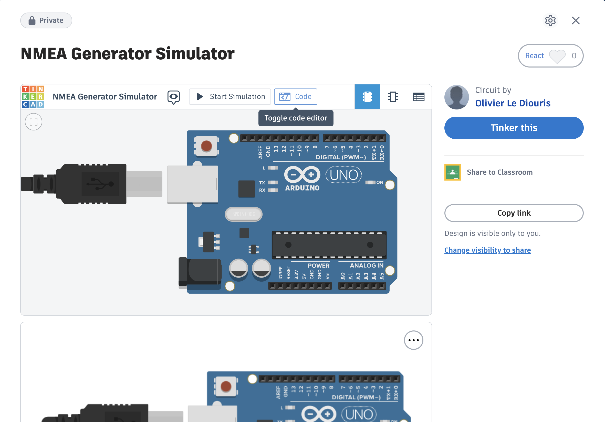
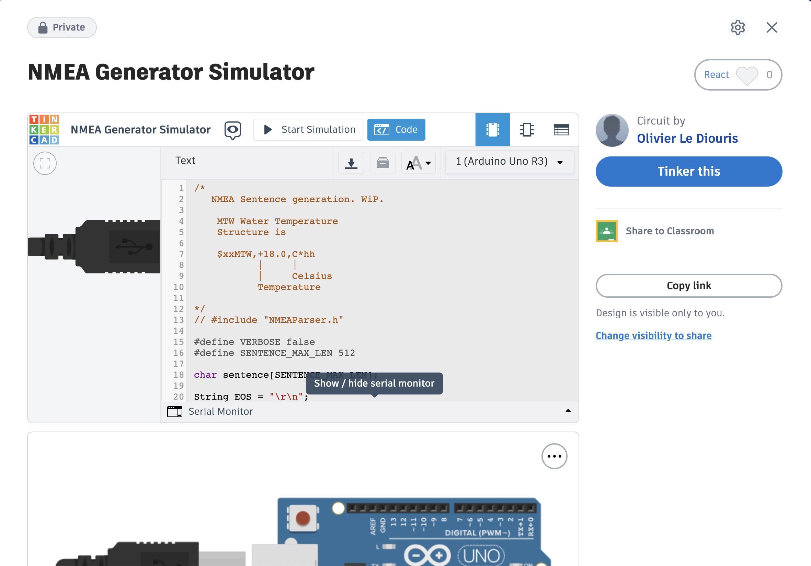
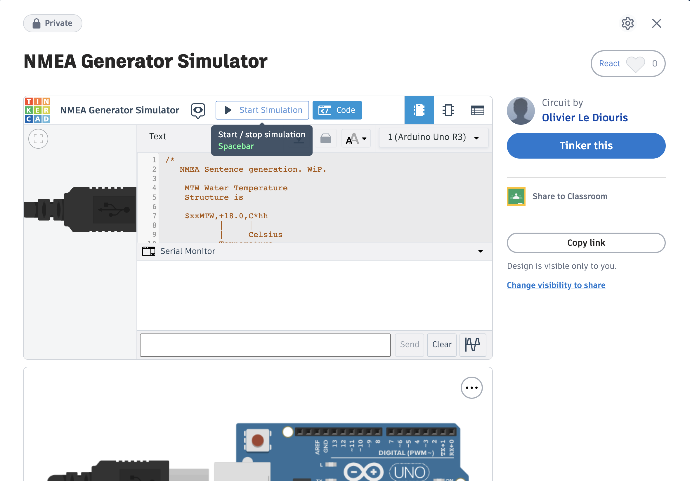
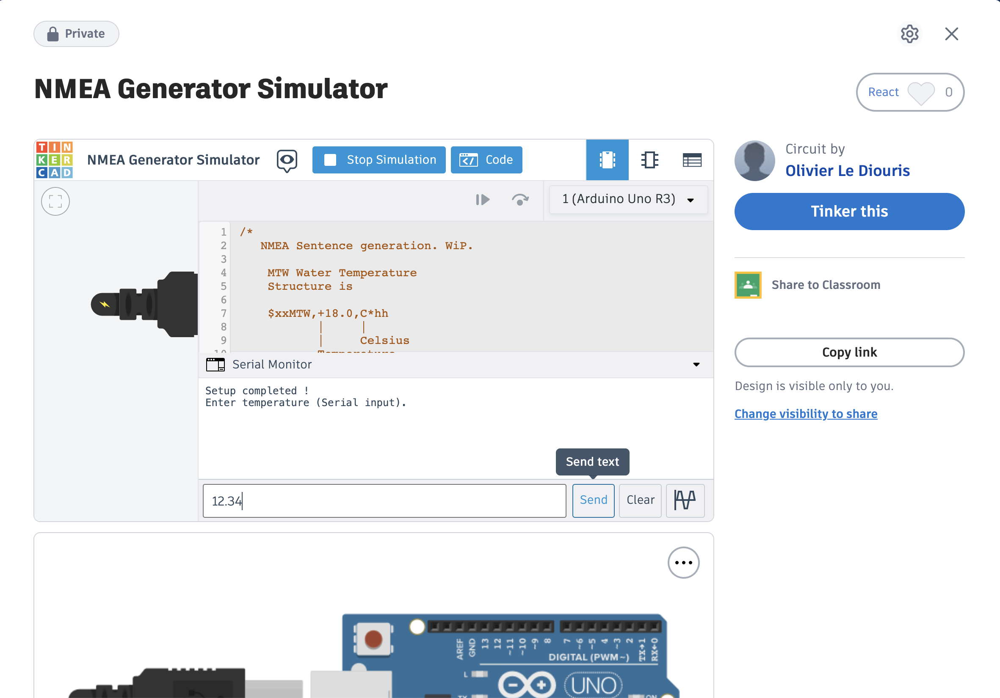
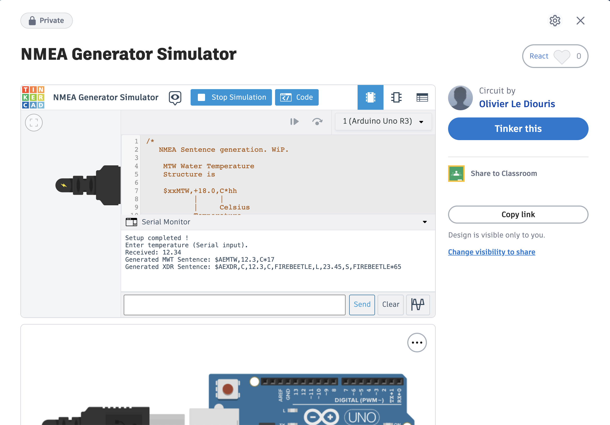
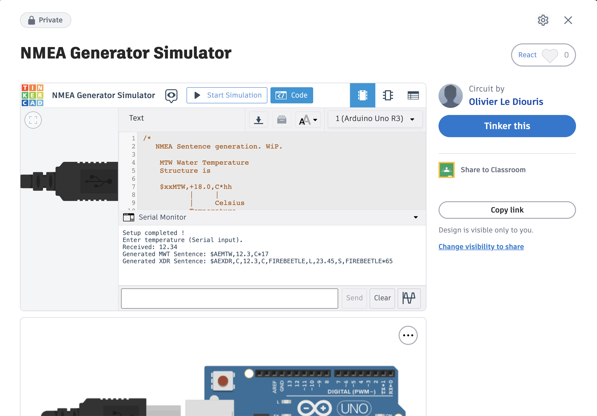

# Lite Version, with no include...

All is in only one file.

## On TinkerCad
See it live on [TinkerCad](https://www.tinkercad.com/things/5Ke3mgqCaAO-nmea-generator-simulator).

The link above brings you here. Click on the "Simulate" button.

Then click the "Code" button, the code pane should show up.

Feel free to read the code, to see how it's done, and open the Serial Monitor, by clicking at the bottom of the code pane.

Then, click the "Start Simulation" button.

The program starts, and when prompted, you can enter a temperature value, like here, `12.34`.  
Next click the "Send" button.

The generated NMEA Sentences show up in the Serial Monitor.   
You can enter new values for the temperature, and repeat the operation at will.  
Click "Stop Simulation" when done.

That's it !

---