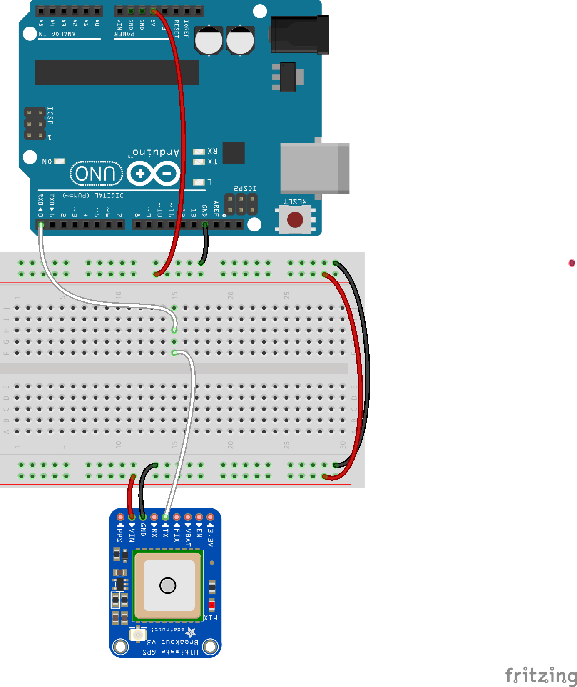

# Arduino (and friends)
Doc at <https://www.arduino.cc/reference/en/>

## Arduino, read Serial data

> Note: if you have trouble uploading your sketch(es), do unplug the Serial data provider (like the GPS), and try again. 
> It worked for me.

### Wiring


Here the GPS is an [Adafruit Ultimate GPS Breakout - 66 channel w/10 Hz updates - Version 3](https://www.adafruit.com/product/746)

### The code
- `SerialDump.ino` shows the basics. 
- `SerialReader.ino` format the NMEA Sentences, and spit them out in the Serial Console:
```
07:50:39.415 -> Setup completed
07:50:42.417 -> $PGACK,103*40
07:50:42.417 -> $PGACK,105*46
07:50:42.453 -> $PMTK011,MTKGPS*08
07:50:43.424 -> $PMTK010,001*$GPGGA,235942.800,,,,,0,0,,,M,,M,,*4B
07:50:44.407 -> $GPGSA,A,1,,,,,,,,,,,,,,$GPGGA,235943.800,,,,,0,0,,,M,,M,,*4A
07:50:45.428 -> $GPGSA,A,1,,,,,,,,,,,,,,$GPGGA,235944.799,,,,,0,0,,,M,,M,,*42
07:50:46.428 -> $GPGSA,A,1,,,,,,,,,,,,,,$GPGGA,235945.799,,,,,0,0,,,M,,M,,*43
07:50:47.426 -> $GPGSA,A,1,,,,,,,,,,,,,,$GPGGA,235946.799,,,,,0,0,,,M,,M,,*40
07:50:48.413 -> $GPGSA,A,1,,,,,,,,,,,,,,$GPGGA,235947.799,,,,,0,0,,,M,,M,,*41
07:50:49.424 -> $GPGSA,A,1,,,,,,,,,,,,,,$GPGGA,235948.799,,,,,0,0,,,M,,M,,*4E
07:50:50.429 -> $GPGSA,A,1,,,,,,,,,,,,,,$GPGGA,235949.799,,,,,0,0,,,M,,M,,*4F
07:50:51.440 -> $GPGSA,A,1,,,,,,,,,,,,,,$GPGGA,235950.800,,,,,0,0,,,M,,M,,*48
07:50:52.426 -> $GPGSA,A,1,,,,,,,,,,,,,,$GPGGA,235951.800,,,,,0,0,,,M,,M,,*49
07:50:53.426 -> $GPGSA,A,1,,,,,,,,,,,,,,$GPGGA,235952.800,,,,,0,0,,,M,,M,,*4A
07:50:54.425 -> $GPGSA,A,1,,,,,,,,,,,,,,$GPGGA,235953.800,,,,,0,0,,,M,,M,,*4B
. . .
```

#### Energy Consumption
In this config, the Pico consumes between 0.04 and 0.06 Amps.
