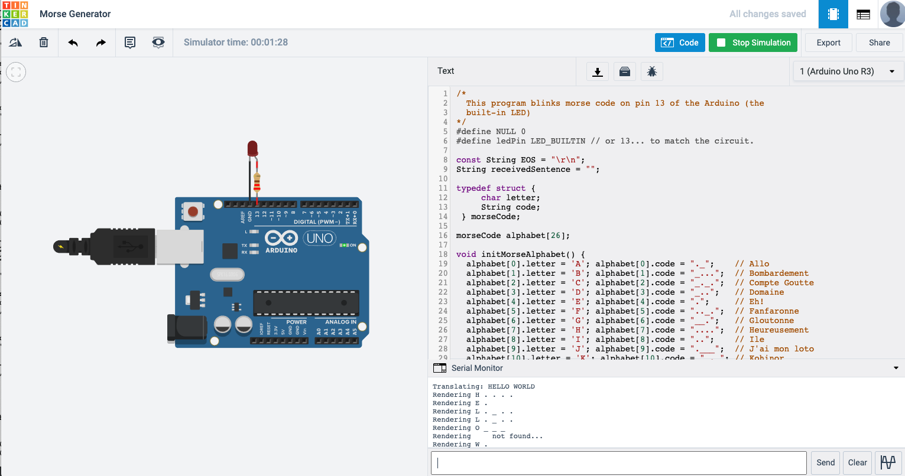

# Arduino Morse Generator
Also available on [TinkerCAD](https://www.tinkercad.com/things/7RGhSjmQfOj-morse-generator/editel), where it can run in a simulator.



Enter a sentence in the Serial Monitor, and see the led blinking accordingly.

### Bonus: A mnemotechnic method to learn the Morse code
Look at the way the characters are defined:
```C
void initMorseAlphabet() {
  // Letters
  alphabet[0].letter = 'A';  alphabet[0].code = "._";    // Allo
  alphabet[1].letter = 'B';  alphabet[1].code = "_...";  // Bombardement
  alphabet[2].letter = 'C';  alphabet[2].code = "_._.";  // Compte Goutte
  alphabet[3].letter = 'D';  alphabet[3].code = "_..";   // Domaine
  alphabet[4].letter = 'E';  alphabet[4].code = ".";     // Eh!
  alphabet[5].letter = 'F';  alphabet[5].code = ".._.";  // Fanfaronne
  alphabet[6].letter = 'G';  alphabet[6].code = "__.";   // Gloutonne
  alphabet[7].letter = 'H';  alphabet[7].code = "....";  // Heureusement
  alphabet[8].letter = 'I';  alphabet[8].code = "..";    // Ile
  alphabet[9].letter = 'J';  alphabet[9].code = ".___";  // J'ai mon loto
  alphabet[10].letter = 'K'; alphabet[10].code = "_._";  // Kohinor
  alphabet[11].letter = 'L'; alphabet[11].code = "._.."; // Linotype
  alphabet[12].letter = 'M'; alphabet[12].code = "__";   // Moto
  alphabet[13].letter = 'N'; alphabet[13].code = "_.";   // Note
  alphabet[14].letter = 'O'; alphabet[14].code = "___";  // Oloron
  alphabet[15].letter = 'P'; alphabet[15].code = ".__."; // Pyrophore
  alphabet[16].letter = 'Q'; alphabet[16].code = "__._"; // Quocorico
  alphabet[17].letter = 'R'; alphabet[17].code = "._.";  // Raisonne
  alphabet[18].letter = 'S'; alphabet[18].code = "...";  // Salade
  alphabet[19].letter = 'T'; alphabet[19].code = "_";    // Top
  alphabet[20].letter = 'U'; alphabet[20].code = ".._";  // Unisson
  alphabet[21].letter = 'V'; alphabet[21].code = "..._"; // Vegetation
  alphabet[22].letter = 'W'; alphabet[22].code = ".__";  // Wagon long
  alphabet[23].letter = 'X'; alphabet[23].code = "_.._"; // Xochimilco
  alphabet[24].letter = 'Y'; alphabet[24].code = "_.__"; // Yotcheoufou
  alphabet[25].letter = 'Z'; alphabet[25].code = "__.."; // Zoroastre
  // Digits
  alphabet[26].letter = '1'; alphabet[26].code = ".____";
  alphabet[27].letter = '2'; alphabet[27].code = "..___";
  alphabet[28].letter = '3'; alphabet[28].code = "...__";
  alphabet[29].letter = '4'; alphabet[29].code = "...._";
  alphabet[30].letter = '5'; alphabet[30].code = ".....";
  alphabet[31].letter = '6'; alphabet[31].code = "-....";
  alphabet[32].letter = '7'; alphabet[32].code = "__...";
  alphabet[33].letter = '8'; alphabet[33].code = "___..";
  alphabet[34].letter = '9'; alphabet[34].code = "____.";
  alphabet[35].letter = '0'; alphabet[35].code = "_____";
}
```
At the end of each line, there is a French word, commented.
- Each word has as many syllables as there are signs in the letter's code
- Each syllable wth an `o` is a dash
- Other syllables are dots.
- Example: `V` : `Ve`-`ge`-`ta`-`tion`
    - Four signs
    - Last one is a dash, others are dots
    - `V` = `..._`

---
