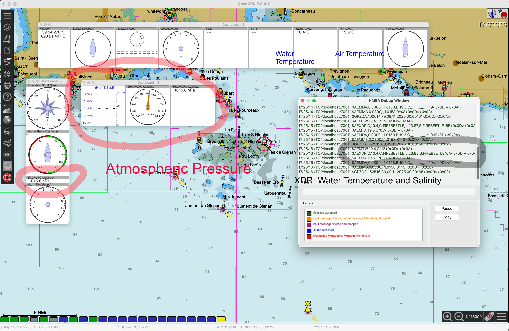

# Step 1

Il s'agit de générer des chaînes NMEA (0183) contenant les infos des capteurs, de sorte qu'elles soient lisibles par des programmes comme [OpenCPN](https://opencpn.org/).

Les infos à propager sont :
- La température de l'eau.
- La salinité de l'eau.
- Pression et température atmosphériques.

Une bonne doc sur les chaînes NMEA [ici](https://gpsd.gitlab.io/gpsd/NMEA.html). Et [ici](https://www.plaisance-pratique.com/IMG/pdf/NMEA0183-2.pdf) aussi, en pdf.

---

La génération d'une chaîne NMEA comporte deux étapes essentielles :
- La génération de la chaîne, conformément au standard
- La génération du checksum (les deux derniers caractères de la chaîne, après le `*`), qui assure de la validité des infos contenues dans la chaîne.

---

- Pour la température de l'eau, on utilisera [`MTW`](https://gpsd.gitlab.io/gpsd/NMEA.html#_mtw_mean_temperature_of_water) (Mean Temperature of Water).
- Pour la salinité, la chaîne [`XDR`](https://gpsd.gitlab.io/gpsd/NMEA.html#_xdr_transducer_measurement) (Transducer Measurements) peut convenir.
- Pression et température atmosphériques peuvent être gérées par [`MDA`](https://gpsd.gitlab.io/gpsd/NMEA.html#_mda_meteorological_composite) (Meteorological Composite).
  - La chaîne `MMB` (Atmospheric Pressure) peut aussi convenir.
  - Idem pour `MTA` (Mean Temperature of Air).

Les chaînes `MTW`, `MDA`, `MMB` et `MTA` sont comprises sans soucis par de plugin "Dashboard" d'OpenCPN.  
Pour `XDR`, il faudra sans doute écrire un plugin spécifique.

---

Pour info, voici la structure des chaînes :

```
 MMB Atmospheric pressure
 Structure is $IIMMB,29.9350,I,1.0136,B*7A
                     |       | |      |
                     |       | |      Bars
                     |       | Pressure in Bars
                     |       Inches of Hg
                     Pressure in inches of Hg
```

```
 MTA Air Temperature
 Structure is $IIMTA,020.5,C*30
                     |     |
                     |     Celsius
                     Temperature in Celsius
```

```
 MDA Meteorological Composite
 $--MDA,x.x,I,x.x,B,x.x,C,x.x,C,x.x,x.x,x.x,C,x.x,T,x.x,M,x.x,N,x.x,M*hh&lt;CR&gt;&lt;LF&gt;
        |     |     |     |     |   |   |     |     |     |     |
        |     |     |     |     |   |   |     |     |     |     19-Wind speed, m/s
        |     |     |     |     |   |   |     |     |     17-Wind speed, knots
        |     |     |     |     |   |   |     |     15-Wind dir Mag
        |     |     |     |     |   |   |     13-Wind dir, True
        |     |     |     |     |   |   11-Dew Point C
        |     |     |     |     |   10-Absolute hum %
        |     |     |     |     9-Relative hum %
        |     |     |     7-Water temp in Celsius
        |     |     5-Air Temp in Celsius  |
        |     3-Pressure in Bars
        1-Pressure in inches

 Example: $WIMDA,29.4473,I,0.9972,B,17.2,C,,,,,,,,,,,,,,*3E
```

```
 MTW Water Temperature<br>
 Structure is
 $xxMTW,+18.0,C*hh
        |     |
        |     Celsius
        Temperature
```

```
   XDR - Transducer Measurements
      $--XDR,a,x.x,a,c--c,...    ...a,x.x,a,c--c*hh<CR><LF>
             | |   | |    |        ||     |
             | |   | |    |        |+-----+-- Transducer 'n'
             | |   | |    +--------+- Data for variable # of transducers
             | |   | +- Transducer #1 ID (like 0..n, or PTCH, ROLL, ...)
             | |   +- Units of measure, Transducer #1
             | +- Measurement data, Transducer #1
             +- Transducer type, Transducer #1
      Notes:
      1) Sets of the four fields 'Type-Data-Units-ID' are allowed for an undefined number of transducers.
      Up to 'n' transducers may be included within the limits of allowed sentence length, null fields are not
      required except where portions of the 'Type-Data-Units-ID' combination are not available.
      2) Allowed transducer types and their units of measure are:
      Transducer           Type Field  Units Field              Comments
      -------------------------------------------------------------------
      temperature            C           C = degrees Celsius
      angular displacement   A           D = degrees            "-" = anti-clockwise
      linear displacement    D           M = meters             "-" = compression
      frequency              F           H = Hertz
      force                  N           N = Newton             "-" = compression
      pressure               P           B = Bars, P = Pascal   "-" = vacuum
      flow rate              R           l = liters/second
      tachometer             T           R = RPM
      humidity               H           P = Percent
      volume                 V           M = cubic meters
      generic                G           none (null)            x.x = variable data
      current                I           A = Amperes
      voltage                U           V = Volts
      switch or valve        S           none (null)            1 = ON/ CLOSED, 0 = OFF/ OPEN
      salinity               L           S = ppt                ppt = parts per thousand

      Non-numeric transducer IDs seem to be used as needed, like PTCH, PITCH, ROLL, MAGX, MAGY, MAGZ, AIRT, ENGT, ...
      I found no list of "official" transducer IDs...
      
Example:
      $HCXDR,A,171,D,PITCH,A,-37,D,ROLL,G,367,,MAGX,G,2420,,MAGY,G,-8984,,MAGZ*41

```

---

Le sketch `NMEAGenerator.ino` lit la température saisie par l'utilisateur, et génère 
différentes chaînes NMEA, qui doivent être valides.

```
Received: 12.345

Generated MTW Sentence: $AEMTW,12.3,C*17
Generated XDR Sentence: $AEXDR,C,12.3,C,FIREBEETLE,L,23.45,S,FIREBEETLE*65
Generated MDA Sentence: $AEMDA,0.0299,I,1.0132,B,12.3,C,,,,,,,,,,,,,,,,*19
Generated MMB Sentence: $AEMMB,0.0299,I,1.0132,B*4E
Generated MTA Sentence: $AEMTA,12.3,C*01
```

Les data sont reçues dans OpenCPN.



Il faudra quelque chose pour afficher la salinité plus explicitement.