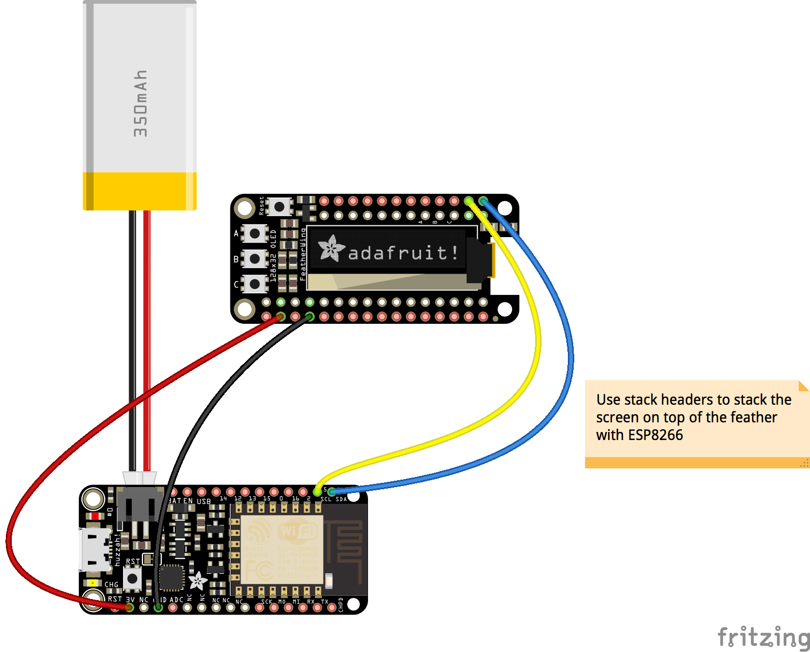
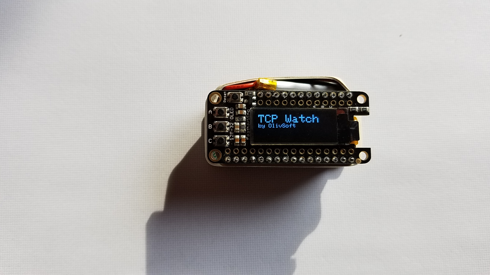
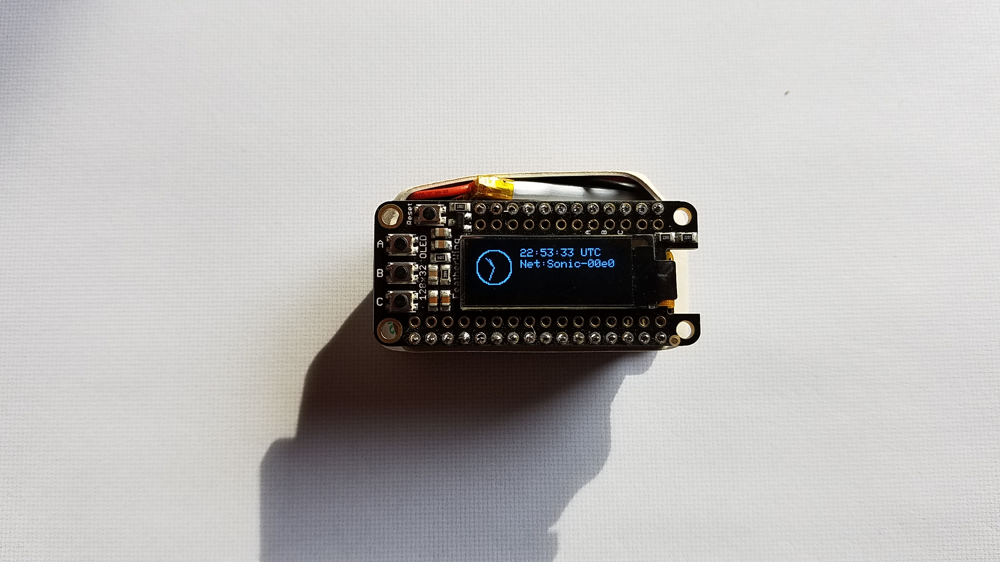

# Feather TCP watch!
<!-- TODO the components reference to the Adafruit site -->

This is probably the smallest of the configurations we talk about around here.
And the Feather can be fed by a LiPo battery, that makes it autonomous.

### Wiring


### Screenshots






### LiPo Battery tests
Done with `feather.lifespan.test.ino` (See the [README.md](../../feather.lifespan.test/README.md) in its folder), the sketck is running on a Feather powered by a LiPo battery, and POSTs data to a REST service every second or so. Data are formatted with `HH:MM:SS`, that represents the time the Feather has been running.

The last posted data can be obtained from another service `GET /feather/lifespan` by any REST client:
```
 $ curl http://localhost:9999/feather/lifespan
  00:11:37
```

#### Some results
| Capacity | Lifespan |  in sec |
|---------:|---------:|--------:|
|  105 mAh | 01:15:04 |   4,504 |
|  400 mAh | 05:21:37 |  19,297 |
| 1200 mAh | 11:55:45 |  42,945 |
| 2500 mAh | 32:46:46 | 119,006 |

This seems _not_ to be linear. The bigger the better...

 ---
