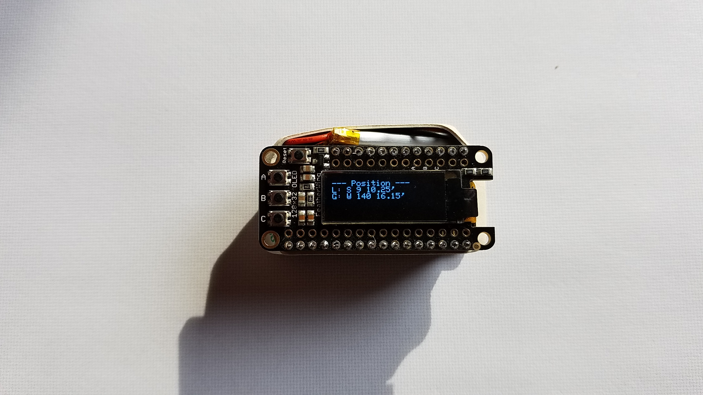
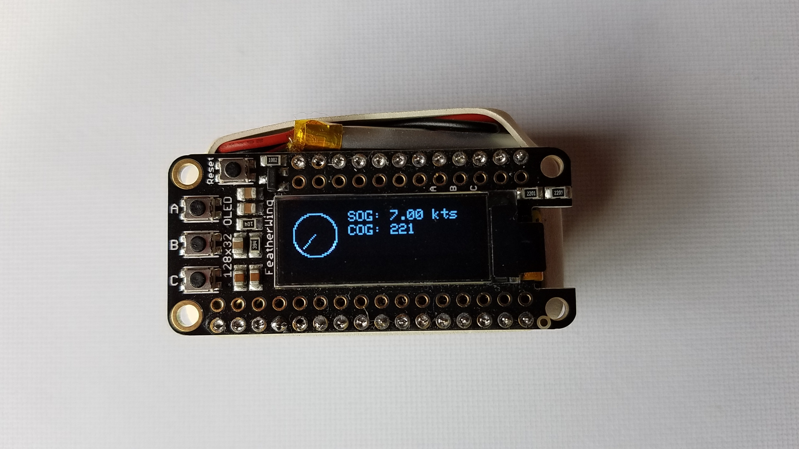

# Feather TCP watch!
<!-- TODO the reference to the Adafruit site -->

This is probably the smallest of the configurations we talk about around here.
And the Feather can be fed by a LiPo battery, that makes it autonomous.

### Wiring

### Screenshots

### LiPo Battery tests

| Capacity | Lifespan |
|---------:|---------:|
|  105 mAh |     1:15 |
|  400 mAh |          |
| 1200 mAh |          |
| 2500 mAh |          |

 ---

Screen on : 1:12:00, keep going => 1:15:00...
End of all 1:16:43
