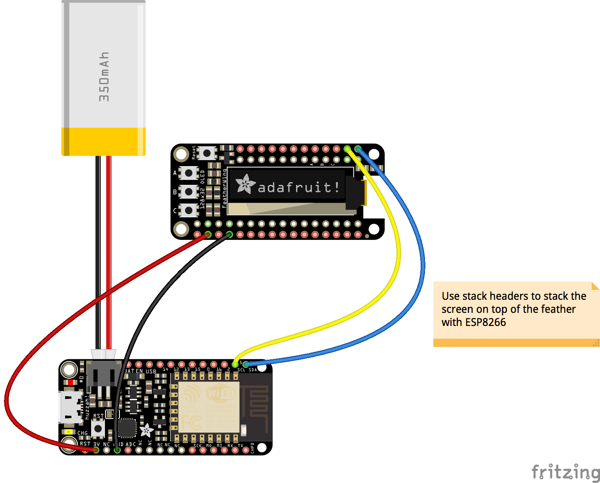
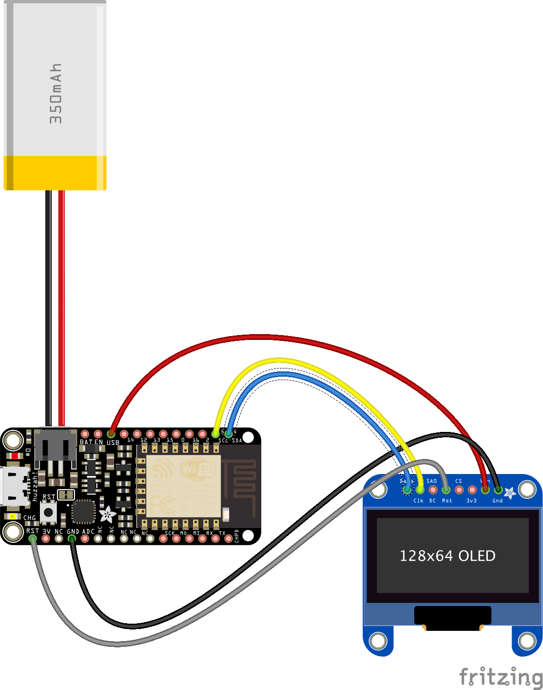

## Using the Adafruit SSD1306 library
### For 128x32 and 128x64 displays

The same code works for both screens, some `#define` statements have to be changed in the code.
The test will display some characters, with different sizes, and do some drawings as well (a watch).

The `I2C` is not the same for both, see in the code
```C
#include <Adafruit_SSD1306.h>

// for 128x32
//#define SSD1306_128x32
//#undef SSD1306_128x64

// for 128x64
#undef SSD1306_128x32
#define SSD1306_128x64

const int SSD1306_WIDTH = 128;

#ifdef SSD1306_128x32
const int SSD1306_I2C_ADDR = 0x3C; // for 128x32
const int SSD1306_HEIGHT = 32;
#endif

#ifdef SSD1306_128x64
const int SSD1306_I2C_ADDR = 0x3D; // for 128x64
const int SSD1306_HEIGHT = 64;
#endif

```

Comment/Uncomment the appropriate lines based on your screen definition
```C
// for 128x32
//#define SSD1306_128x32
//#undef SSD1306_128x64

// for 128x64
#undef SSD1306_128x32
#define SSD1306_128x64

```

#### Wiring the 128x32 (Stack Headers)


#### Wiring the 128x64


---
