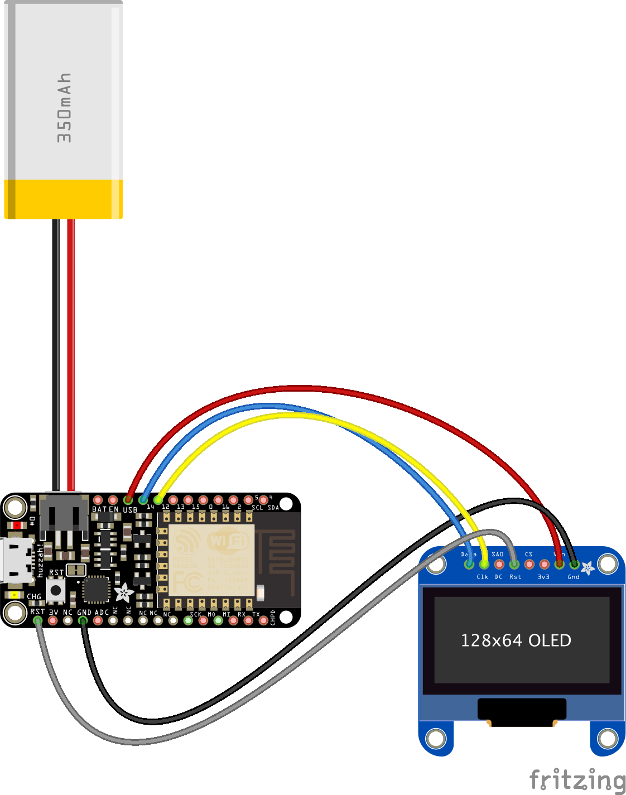
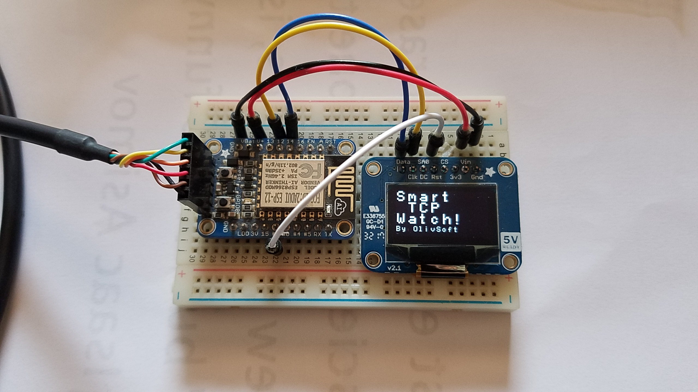
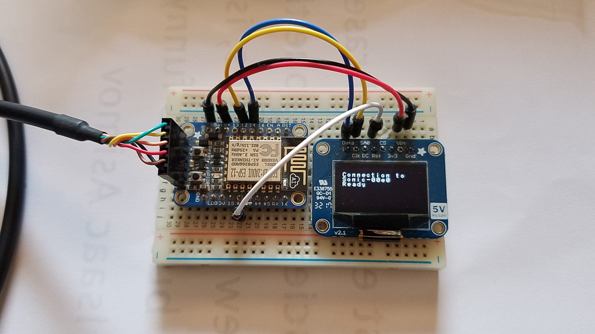
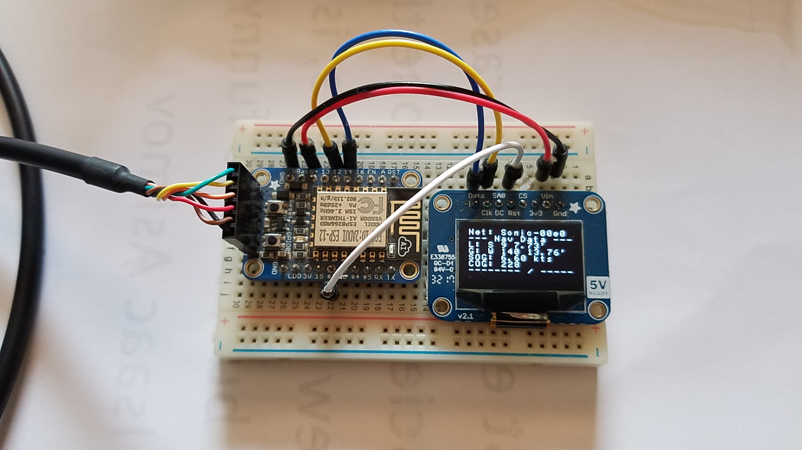
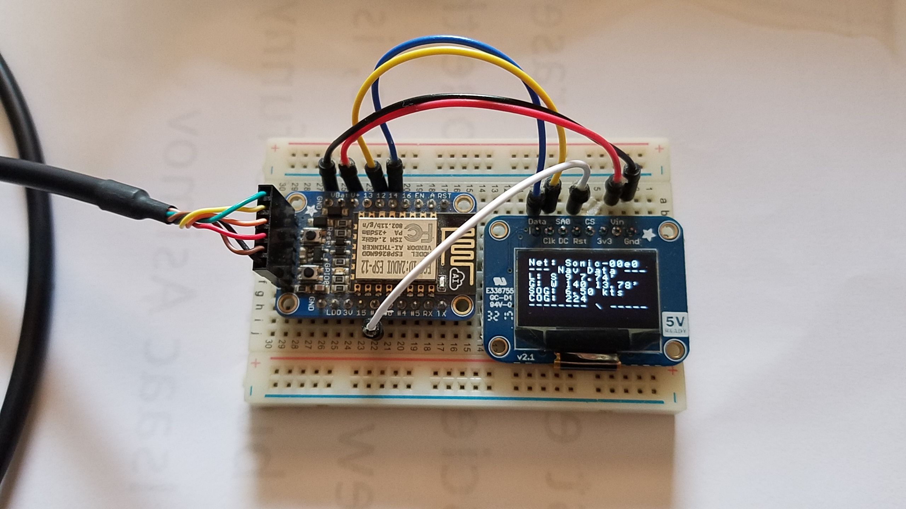
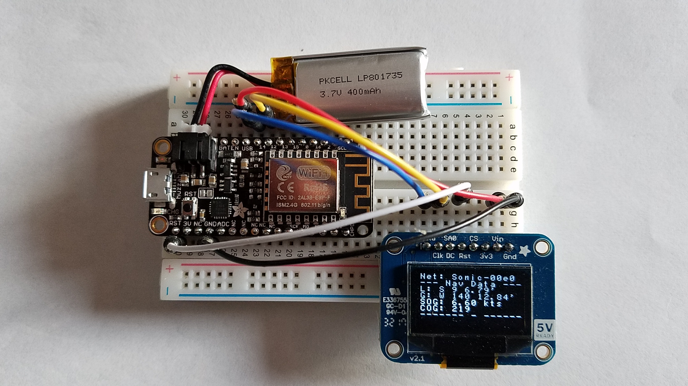

### TCP Smart Watch - WIP 🚧.
The idea is to have a watch-like device that does _not_ need a smart phone to connect to a network.

For now, it seems that _all_ so-called smart watches need a cell-phone to connect to (via BlueTooth) to get to the net.
Ah yes, and why not a dish-washer, or a police car, or an helicopter 🚁 ???

Boards like the ESP8266 (and similar, like the Adafruit Huzzah - less than $10 in Nov-2018, Adafruit Feather Huzzah, etc) have WiFi capabilities that allow you to skip the need for a
cell-phone between you and the network.

OK, the app running on the ESP8266 might need some parameters, some customization, some configuration... fine.
Well, use a USB cable, plug it in your laptop, and off you go.
That's done here through the Arduino IDE, it works just fine.
It might not be as user-friendly as a nice web-page, but I'm working on it.

It will be using REST over HTTP, TCP will come later.

The ESP8266/Huzzah has built-in WiFi capabilities, and can deal with an OLED screen like the `SSD1306`.

The starting point was [this document](https://learn.adafruit.com/huzzah-weather-display?view=all).

The ESP8266 will ping the [NavServer/NMEA.multiplexer](https://github.com/OlivierLD/raspberry-coffee/blob/master/NMEA.multiplexer/README.md) with a request like `GET /mux/cache?option=txt`.

##### Wiring with the Adafruit Huzzah

---

##### Wiring with the Adafruit Feather Huzzah

---

##### Prototyping with an Huzzah/ESP8266

---

##### Prototyping with an Adafruit Feather Huzzah/ESP8266

---
