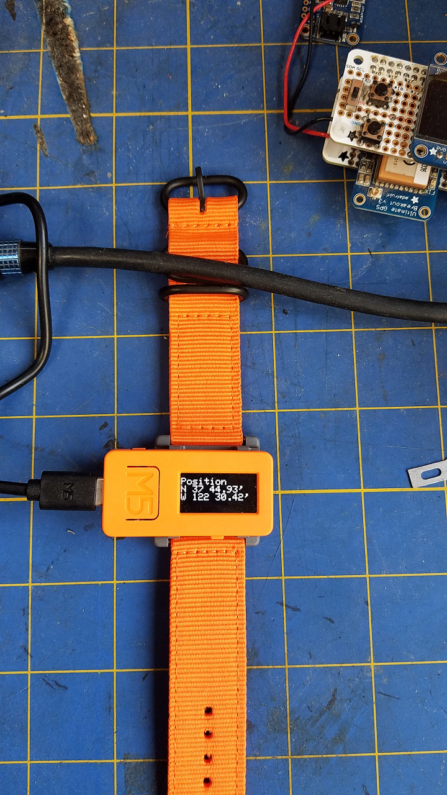
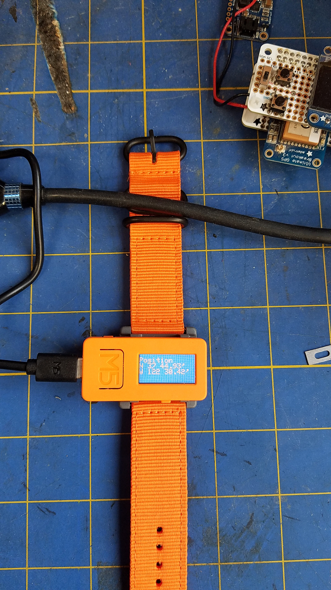

## M5Stick-C
- See <http://m5edu.com/Product/m5stick-c-micro-core/>
- See <http://forum.m5stack.com/topic/41/lesson-1-1-lcd-graphics>

Hostname is `espressif`.

Example: Client for the Nav Server (`HttpClient.ino`)

|    B & W            |    Colors           |
|:-------------------:|:-------------------:|
|  |  |

#### To fit your environment
- You need a `NavServer` or an `NMEA.multiplexer` to be available, possibly emitting its own network (aka hotspot), as explained [here](https://github.com/OlivierLD/raspberry-coffee/tree/master/NMEA.mux.WebUI), [here](https://github.com/OlivierLD/raspberry-coffee/blob/master/NMEA.mux.WebUI/small.server.extended/README.md), and around...
- Modify the sketch's code appropriately, in my case:
```C
const char* SSID = "RPi-Gateway";           // your network SSID (name)
const char* PASSWORD = "raspberrypi";       // your network password
const char* SERVER_NAME = "192.168.50.10";  // For REST requests, Nav Server
```

Upload the sketch on the `M5Stcik-C`, and you're good to go! You have debug messages in the `Serial` console.
