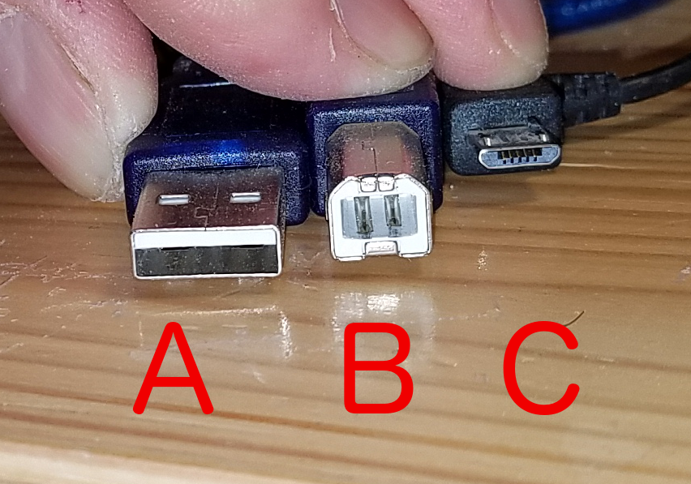
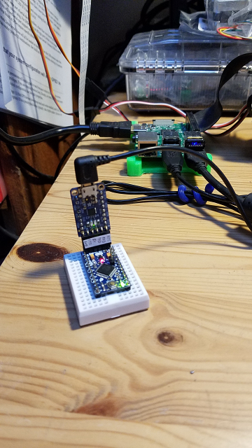
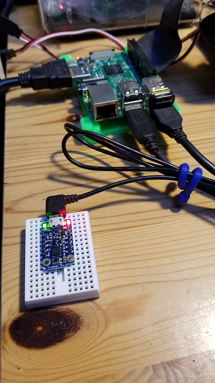

## Small Boards (MicroControllers)
We will talk here about the way to develop code for those small PCBs, as well as about the different ways to communicate with them, from other machines.

Several possibilities are available, among them:
- Serial
- I2C
    - About I2C, see how to use those small boards as I<sup><small>2</small></sup>C slaves [here](https://github.com/OlivierLD/raspberry-coffee/blob/master/I2C.SPI/src/i2c/comm/README.md).
- In some cases (i.e. when the PCB has WiFi capabilities), REST over HTTP, TCP, can be used too.

We will also talk - as a reminder - about the way to upload and run sketches on those boards. They do not all follow the same "protocol"...

#### Arduino Uno, Arduino Mini, ESP8266 (Huzzah), Adafruit Trinket, Photon, etc
Examples of code are provided in the sub-directories of this project.

###### Universal Serial Bus (USB)
_Universal_, but there are at least 3 versions: A, B, C...:



## Install the Arduino IDE on the Raspberry PI
> _Note_: The Arduino IDE is also available on other platforms (MacOS, Windows, many Linux distributions).

- Go to [arduino.cc](https://www.arduino.cc/) -> Software
- Download the last version for Linux ARM

Then (in 2017)

```bash
 $ cd ~/Downloads
 $ tar -xvf arduino-1.8.5-linuxarm.tar.xz
 $ sudo mv arduino-1.8.5 /opt
 $ cd /opt/arduino-1.8.5
 $ ./install.sh
```

### Arduino Uno
Use a USB-A to USB-B (male-male) cable.

For Arduino Uno, use board `Arduino/Genuino Uno`.


Programmer: `AVRISP mkII`

### Arduino Mini
Use a [CP2104](https://www.adafruit.com/product/3309) connector, itself using a USB-A to USB-C (male-male) cable.



Programmer: `AVRISP mkII`

For Arduino Pro Mini, use board `Arduino Pro or Pro Mini`, Processor `ATmega328P (3.3V, 8MHz)`, even for 5 volts version.

### Arduino Nano (33 BLE Sense in my case)
Use a USB-A to USB-C (male-male) cable.

Programmer: `AVRISP mkII`.

### SparkFun Edge
Cheap, TensorFlow compatible... Keep posted.

Keep an eye on what you need to connect, and to upload (Serial Basic, like [CP2104](https://www.adafruit.com/product/3309))...

See [here](https://www.sparkfun.com/products/15170)


### ESP8266 (Adafruit Huzzah)
Programmer: `AVRISP mkII`.

In the Arduino IDE, got to `File > Preferences`, and add a URL in `Boards Manager URLS`:
```
 http://arduino.esp8266.com/stable/package_esp8266com_index.json
```
Connect the Huzzah to the Raspberry PI with an [FTDI cable](https://www.adafruit.com/product/70), make sure the black goes on the `GND`.


To upload a sketch:
- press the `GPIO0` button
- press the `Reset` button
- release the `Reset` button
- release the `GPIO0` button

The red led should be dimmed, the board is ready to receive the sketch, you can upload it from the IDE.

> _Note_: The [Adafruit Feather HUZZAH with ESP8266](https://learn.adafruit.com/adafruit-feather-huzzah-esp8266) has similar capabilities, but automatically uploads your sketches,
> you do not need to juggle with the `GPIO0` and `Reset` buttons like above. It also does _not_ require an FTDI cable,
> a regular USB (A to C) does the job. It's a very cool little board.

### Adafruit 5v Trinket
Programmer: `USBtinyISP`.

In the Arduino IDE, got to `File > Preferences`, and add a URL in `Boards Manager URLS`:
```
 https://adafruit.github.io/arduino-board-index/package_adafruit_index.json
```
Use a USB-A to USB-C (male-male) cable.



To upload a sketch:
- Press the button on the Trinket - verify you see the red LED pulse. This means it is ready to receive data.

See the [Adafruit tutorial](https://learn.adafruit.com/introducing-trinket?view=all).

### Photon
Use a USB-A to USB-C (male-male) cable.

Beside that, the `Photon` uses its own web-based IDE, at [https://build.particle.io](https://build.particle.io).
The code is similar to what's used above. It also comes with a free access to an IoT server.

### M5StickC
See <http://m5edu.com/Product/m5stick-c-micro-core/>

Very cool, and very cheap.

### Adafruit Circuit Playground Express
- Use a USB-A to USB-C (male-male) cable.
- <https://www.adafruit.com/product/3333>, <https://learn.adafruit.com/adafruit-circuit-playground-express?view=all>

### Adafruit Clue
- Use a USB-A to USB-C (male-male) cable.
- See [here](./AdafruitClue/README.md)

---

## To keep an eye on...
- [MicroBlocks](http://microblocks.fun/)
