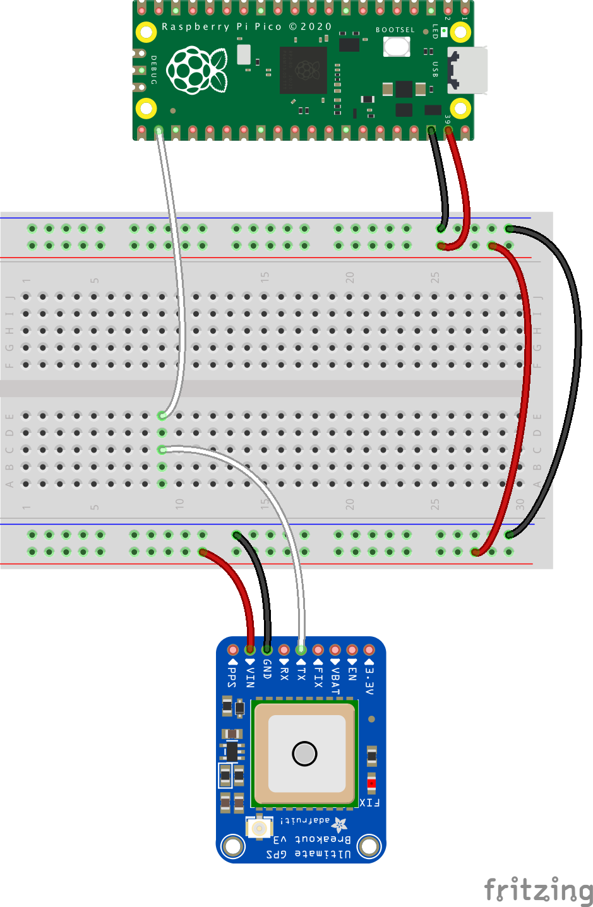

# Different examples

Good blog post at <https://www.raspberrypi.org/blog/raspberry-pi-pico-balloon-tracker/>.

### Read and log GPS data from the Pico



The code is in `read_serial.py`.  
Here the GPS is an [Adafruit Ultimate GPS Breakout - 66 channel w/10 Hz updates - Version 3](https://www.adafruit.com/product/746)

Serial port is read, and NMEA Sentences are built.  
Each completed NMEA Sentence is logged, and the led blinks.

From a Raspberry Pi, copy the Python scripts on the board, so they can be executed later on:

```
$ rshell -p /dev/ttyACM0 --buffer-size 2048
Using buffer-size of 2048
Connecting to /dev/ttyACM0 (buffer-size 2048)...
Trying to connect to REPL  connected
Testing if ubinascii.unhexlify exists ... Y
Retrieving root directories ... /dump_serial.py/ /gps_log.nmea/ /log_temp.py/ /read_serial.py/ /temperature.txt/
Setting time ... Feb 19, 2021 15:50:21
Evaluating board_name ... pyboard
Retrieving time epoch ... Jan 01, 1970
Welcome to rshell. Use Control-D (or the exit command) to exit rshell.
/home/pi/repos/small-boards/RaspberryPi-Pico/MicroPython> cp read_serial.py /pyboard
/home/pi/repos/small-boards/RaspberryPi-Pico/MicroPython> exit
```

Then execute a script:
```
$ minicom -o -D /dev/ttyACM0 -b 115200

Welcome to minicom 2.7.1

OPTIONS: I18n 
Compiled on Aug 13 2017, 15:25:34.
Port /dev/ttyACM0, 15:51:17

Press CTRL-A Z for help on special keys


>>> exec(open("read_serial.py").read())
NMEA Data: $GPGGA,235301.094,,,,,0,0,,,M,,M,,*43
NMEA Data: $GPGSA,A,1,,,,,,,,,,,,,,,*1E
NMEA Data: $GPRMC,235301.094,V,,,,,0.00,0.00,190221,,,N*4F
NMEA Data: $GPVTG,0.00,T,,M,0.00,N,0.00,K,N*32
NMEA Data: $GPGGA,235302.094,,,,,0,0,,,M,,M,,*40
NMEA Data: $GPGSA,A,1,,,,,,,,,,,,,,,*1E
NMEA Data: $GPRMC,235302.094,V,,,,,0.00,0.00,190221,,,N*4C
NMEA Data: $GPVTG,0.00,T,,M,0.00,N,0.00,K,N*32
NMEA Data: $GPGGA,235303.094,,,,,0,0,,,M,,M,,*41
NMEA Data: $GPGSA,A,1,,,,,,,,,,,,,,,*1E
NMEA Data: $GPRMC,235303.094,V,,,,,0.00,0.0,0.00,T,,M,0.00,N,0.00,K,N*32
NMEA Data: $GPGGA,235304.094,,,,,0,0,,,M,,M,,*46
NMEA Data: $GPGSA,A,1,,,,,,,,,,,,,,,*1E
NMEA Data: $GPGSV,1,1,02,19,,,31,17,,,24*71
NMEA Data: $GPRMC,235304.094,V,,,,,0.00,0.0,N*4A
NMEA Data: $GPVTG,0.00,T,,M,0.00,N,0.00,K,N$GPGGA,235305.094,,,,,0,0,,,M,,M,,*47
NMEA Data: $GPGSA,A,1,,,,,,,,,,,,,,,*1E
NMEA Data: $G.00,0.00,190221,,,N*4B
NMEA Data: $GPVTG,K,N*32
NMEA Data: $GPGGA,235306.094,,,,,0,0,,,M,,M,,*44
NMEA Data: $GPGSA,A,1,,,,,,,,,,,,,,,*1E
NMEA Data: $G4,V,,,,,0.00,0.00,190221,,,N*4M,0.00,N,0.00,K,N*32
NMEA Data: $GPGGA,235307.094,,,,,0,0,,,M,,M,,*45
NMEA Data: $GPGSA,A,1,,,,,,,,,,,,,,,*1E
NMEA Data: $G,,,,0.00,0.00,190221,,,N*49
NMEA Data: $,0.00,K,N*32
. . .
```
> Note: for the script of your choice to be executed when the Pico starts, copy it as `/pyboard/main.py`.


After that, you can see/download the log file through `rshell`:
```
$ rshell -p /dev/ttyACM0 --buffer-size 2048
/home/pi/repos/small-boards/RaspberryPi-Pico/MicroPython> ls -l /gps_log.nmea
 10867 Dec 31 16:20 /gps_log.nmea
/home/pi/repos/small-boards/RaspberryPi-Pico/MicroPython> cp /gps_log.nmea .
/home/pi/repos/small-boards/RaspberryPi-Pico/MicroPython> exit
```
Your file is now available locally
```
$ head gps_log.nmea 
$GPGGA,235301.094,,,,,0,0,,,M,,M,,*43
$GPGSA,A,1,,,,,,,,,,,,,,,*1E
$GPRMC,235301.094,V,,,,,0.00,0.00,190221,,,N*4F
$GPVTG,0.00,T,,M,0.00,N,0.00,K,N*32
$GPGGA,235302.094,,,,,0,0,,,M,,M,,*40
$GPGSA,A,1,,,,,,,,,,,,,,,*1E
$GPRMC,235302.094,V,,,,,0.00,0.00,190221,,,N*4C
$GPVTG,0.00,T,,M,0.00,N,0.00,K,N*32
$GPGGA,235303.094,,,,,0,0,,,M,,M,,*41
$GPGSA,A,1,,,,,,,,,,,,,,,*1E
. . .
```

#### Energy Consumption
In this config, the Pico consumes between 0.02 and 0.03 Amps.

---
