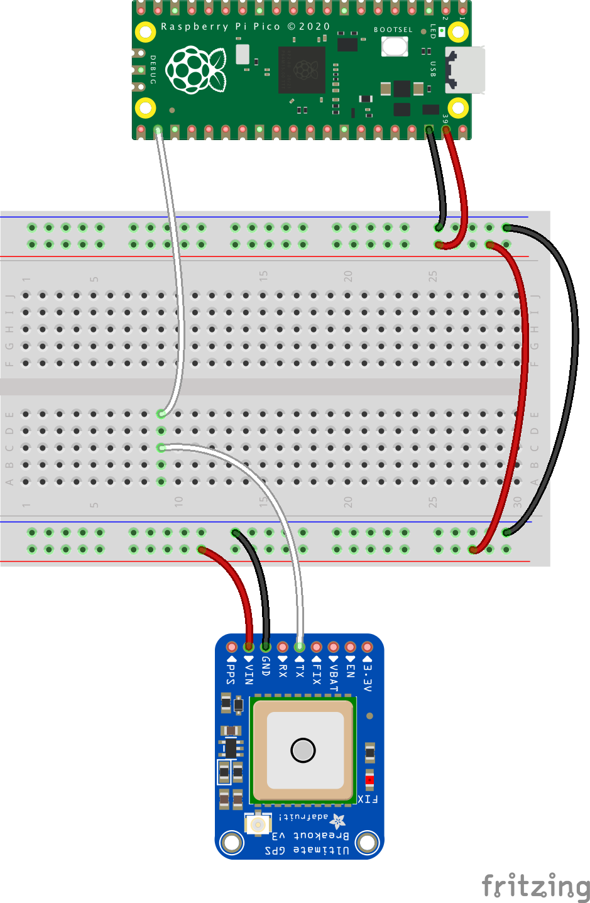
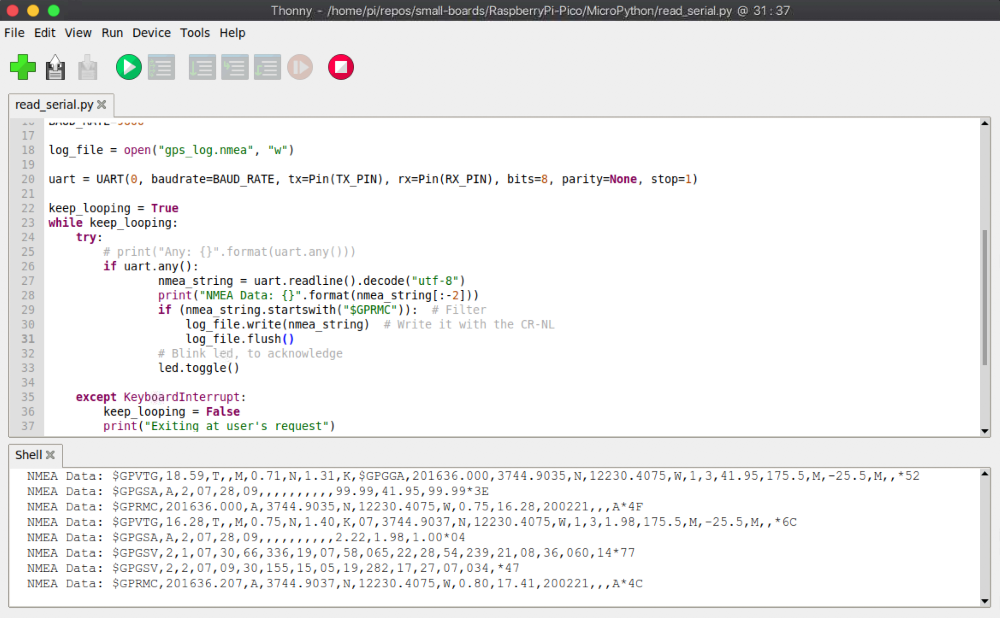

# Different examples

MicroPython doc at <https://docs.micropython.org/en/latest/index.html>

Good blog post at <https://www.raspberrypi.org/blog/raspberry-pi-pico-balloon-tracker/>.

Good tutorials:
- <https://projects.raspberrypi.org/en/projects/getting-started-with-the-pico>
- <https://dronebotworkshop.com/pi-pico/>

### Read and log GPS data from the Pico



The code is in `read_serial.py`.  
Here the GPS is an [Adafruit Ultimate GPS Breakout - 66 channel w/10 Hz updates - Version 3](https://www.adafruit.com/product/746)

Serial port is read, and NMEA Sentences are built.  
Each completed NMEA Sentence is logged, and the led blinks.

From a Raspberry Pi, copy the Python scripts on the board, so they can be executed later on:

```
$ rshell -p /dev/ttyACM0 --buffer-size 2048
Using buffer-size of 2048
Connecting to /dev/ttyACM0 (buffer-size 2048)...
Trying to connect to REPL  connected
Testing if ubinascii.unhexlify exists ... Y
Retrieving root directories ... /dump_serial.py/ /gps_log.nmea/ /log_temp.py/ /read_serial.py/ /temperature.txt/
Setting time ... Feb 19, 2021 15:50:21
Evaluating board_name ... pyboard
Retrieving time epoch ... Jan 01, 1970
Welcome to rshell. Use Control-D (or the exit command) to exit rshell.
/home/pi/repos/small-boards/RaspberryPi-Pico/MicroPython> cp read_serial.py /pyboard
/home/pi/repos/small-boards/RaspberryPi-Pico/MicroPython> exit
```

Then execute a script:
```
$ minicom -o -D /dev/ttyACM0 -b 115200

Welcome to minicom 2.7.1

OPTIONS: I18n 
Compiled on Aug 13 2017, 15:25:34.
Port /dev/ttyACM0, 15:51:17

Press CTRL-A Z for help on special keys


>>> exec(open("read_serial.py").read())
NMEA Data: $GPGGA,235301.094,,,,,0,0,,,M,,M,,*43
NMEA Data: $GPGSA,A,1,,,,,,,,,,,,,,,*1E
NMEA Data: $GPRMC,235301.094,V,,,,,0.00,0.00,190221,,,N*4F
NMEA Data: $GPVTG,0.00,T,,M,0.00,N,0.00,K,N*32
NMEA Data: $GPGGA,235302.094,,,,,0,0,,,M,,M,,*40
NMEA Data: $GPGSA,A,1,,,,,,,,,,,,,,,*1E
NMEA Data: $GPRMC,235302.094,V,,,,,0.00,0.00,190221,,,N*4C
NMEA Data: $GPVTG,0.00,T,,M,0.00,N,0.00,K,N*32
NMEA Data: $GPGGA,235303.094,,,,,0,0,,,M,,M,,*41
NMEA Data: $GPGSA,A,1,,,,,,,,,,,,,,,*1E
NMEA Data: $GPRMC,235303.094,V,,,,,0.00,0.0,0.00,T,,M,0.00,N,0.00,K,N*32
NMEA Data: $GPGGA,235304.094,,,,,0,0,,,M,,M,,*46
NMEA Data: $GPGSA,A,1,,,,,,,,,,,,,,,*1E
NMEA Data: $GPGSV,1,1,02,19,,,31,17,,,24*71
NMEA Data: $GPRMC,235304.094,V,,,,,0.00,0.0,N*4A
NMEA Data: $GPVTG,0.00,T,,M,0.00,N,0.00,K,N$GPGGA,235305.094,,,,,0,0,,,M,,M,,*47
NMEA Data: $GPGSA,A,1,,,,,,,,,,,,,,,*1E
NMEA Data: $G.00,0.00,190221,,,N*4B
NMEA Data: $GPVTG,K,N*32
NMEA Data: $GPGGA,235306.094,,,,,0,0,,,M,,M,,*44
NMEA Data: $GPGSA,A,1,,,,,,,,,,,,,,,*1E
NMEA Data: $G4,V,,,,,0.00,0.00,190221,,,N*4M,0.00,N,0.00,K,N*32
NMEA Data: $GPGGA,235307.094,,,,,0,0,,,M,,M,,*45
NMEA Data: $GPGSA,A,1,,,,,,,,,,,,,,,*1E
NMEA Data: $G,,,,0.00,0.00,190221,,,N*49
NMEA Data: $,0.00,K,N*32
. . .
NMEA Data: $GPGSA,A,3,18,13,23,20,15,29,26,,,,,,1.72,1.45,0.92*0E
NMEA Data: $GPRMC,071145.000,A,3744.9360,N,12230.4213,W,0.39,20.56,220221,,,D*4B
	>> 19814 record(s) in the log (1,418,518 bytes)
NMEA Data: $GPVTG,20.56,T,,M,0.39,N,0.73,K,$GPGGA,071146.000,3744.9359,N,12230.4212,W,2,7,1.45,9.0,M,-25.5,M,0000,0000*6C
NMEA Data: $GPGSA,A,3,18,13,23,20,15,29,26,,,,,,1.72,1.45,0.92*0E
NMEA Data: $GPRMC,071146.000,A,3744.9359,N,12230.4212,W,0.42,20.56,220221,,,D*4F
Drive is full, exiting.

```
> Note: for the script of your choice to be executed when the Pico starts, copy it as `/pyboard/main.py`.


After that, you can see/download the log file through `rshell`:
```
$ rshell -p /dev/ttyACM0 --buffer-size 2048
/home/pi/repos/small-boards/RaspberryPi-Pico/MicroPython> ls -l /gps_log.nmea
 10867 Dec 31 16:20 /gps_log.nmea
/home/pi/repos/small-boards/RaspberryPi-Pico/MicroPython> cp /gps_log.nmea .
/home/pi/repos/small-boards/RaspberryPi-Pico/MicroPython> exit
```
Your file is now available locally, for procesing if needed
```
$ head gps_log.nmea 
$GPRMC,014132.000,A,3745.0115,N,12230.4638,W,1.54,280.74,220221,,,A*7A
$GPRMC,014133.000,A,3745.0114,N,12230.4639,W,1.49,283.92,220221,,,A*7C
$GPRMC,014134.000,A,3745.0116,N,12230.4643,W,2.67,286.20,220221,,,A*77
$GPRMC,014135.000,A,3745.0119,N,12230.4648,W,3.62,288.48,220221,,,A*76
$GPRMC,014136.000,A,3745.0123,N,12230.4655,W,3.84,291.10,220221,,,A*7D
$GPRMC,014137.000,A,3745.0122,N,12230.4655,W,2.44,293.56,220221,,,A*70
$GPRMC,014138.000,A,3745.0122,N,12230.4654,W,1.70,318.61,220221,,,A*7C
$GPRMC,014139.000,A,3745.0118,N,12230.4650,W,0.76,290.12,220221,,,A*72
$GPRMC,014140.000,A,3745.0116,N,12230.4648,W,1.17,323.42,220221,,,A*71
. . .
```

> Note: the Pico has ~1.3Mb of flash memory. You might want to filter the data to log, to save space (the `read_serial.py` script filters on `RMC` strings), or even impose an iterval between recordings.

With a filter on `RMC` (no minimum interval), I was able to log about 5:30 hours of data.
```
From 22-02-21 01:41:32 UTC to 22-02-21 07:11:45 UTC
```


Works fine from Thonny too:

> Note: In Thonny, I used the menu `Tools` > `Options...` > `Interpreter`, and choosed `MicroPython (generic)`/`Board in FS mode - Board CDC (dev/ttyACM0)`. Updating my Thonny to its last version would probably show what the doc is talking about. Anyway, that works.



#### Energy Consumption
In this config, the Pico consumes between 0.02 and 0.03 Amps.

#### Further
To parse NMEA data in Python, see [this](https://github.com/OlivierLD/oliv-ai/tree/master/JupyterNotebooks/nmea)

---
