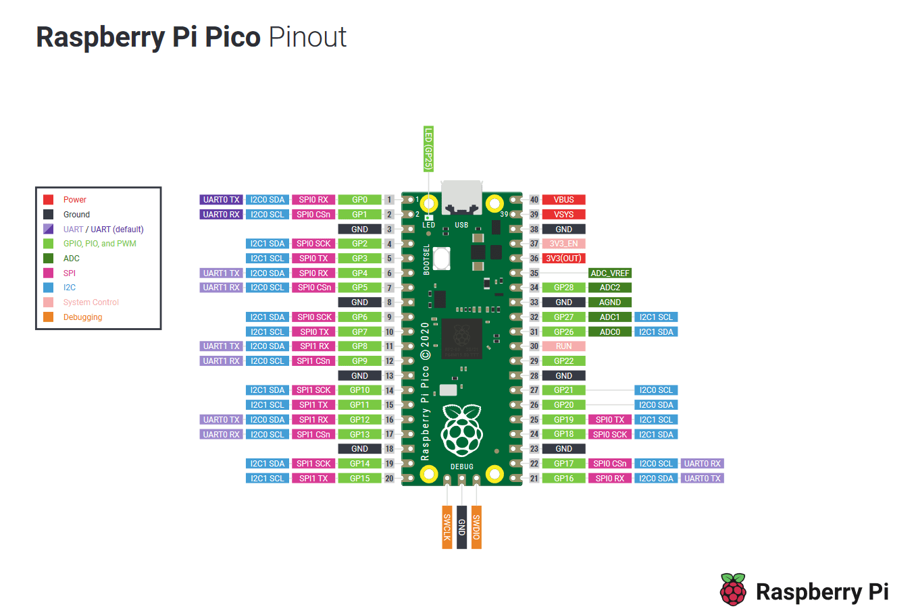

# Raspberry Pi Pico
Can be programmed several ways.


- <https://www.raspberrypi.org/documentation/pico/getting-started/>
- <https://www.raspberrypi.com/documentation/microcontrollers/pico-series.html>

Code Club on Pico W:
- <https://projects.raspberrypi.org/en/projects/get-started-pico-w>

Pico 1 is a `RP2040`, Pico 2 is a `RP2350`.

## MicroPython
- <https://datasheets.raspberrypi.org/pico/sdk/pico_python_sdk.pdf>
- <https://core-electronics.com.au/tutorials/getting-started-with-raspberry-pi-pico.html>
- <https://www.twilio.com/blog/programming-raspberry-pi-pico-microcontroller-micropython>

If `minicom` is not available (like on a Mac), use `screen`.  

- Start the Pico, _**with the button pushed**_
- Drag the `pico_micropyhton_20210121.uf2` on the Pico's "drive"
- A Serial new port should be available when the copy is done.

### From a Mac
The port for the Raspberry Pi Pico could be like `/dev/tty.usbmodem0000000000001`,
or `/dev/tty.usbmodem1421301`...  

```
$ screen /dev/tty.usbmodem0000000000001 9600
>>>
```
> Other baud rates work too (like `115200`)

If needed, hit `[Return]` to get to the prompt.  
Type `[Ctrl+D]` at the prompt:
```
>>> 
MPY: soft reboot
MicroPython v1.13-290-g556ae7914 on 2021-01-21; Raspberry Pi Pico with RP2040
Type "help()" for more information.
>>> 
```
Then try `help()`, and this kind of things, you _**are**_ in a Python REPL.  
Good!  
Try that:
```
>>> from machine import Pin
>>> led = Pin(25, Pin.OUT)
>>> led.value(1)
>>> led.value(0)
```
**To exit** `screen`, do a `[Ctrl-a]` then `d`.

- See <https://pbxbook.com/other/mac-tty.html>

### From a Raspberry Pi

#### Using Thonny
- [Good resource](https://www.youtube.com/watch?v=_ouzuI_ZPLs)  

- Plug in your Raspberry Pi Pico to the Raspberry Pi, holding down the `BOOTSEL` button
- Then Open `Thonny`
    - In the Menu `Run` > `Select Interpreter`, select `MicroPython (Raspnberry Pi Pico`).
    - Not mandatory but useful: `View` > `Files`


#### Other option
You will need `minicom`:
```
$ sudo apt install minicom
```
then (with the Pico connected, probably on `/dev/ttyACM0`)
```
$ minicom -o -D /dev/ttyACM0 [-b 115200]
Welcome to minicom 2.7.1

OPTIONS: I18n 
Compiled on Aug 13 2017, 15:25:34.
Port /dev/ttyACM0, 16:58:34

Press CTRL-A Z for help on special keys


>>> 
```
Hit `[Return]` if needed to get to the prompt.  
Then, just like above, try that:
```
>>> from machine import Pin
>>> led = Pin(25, Pin.OUT)
>>> led.value(1)
>>> led.value(0)
```
To exit `minicom`, do a `[Ctrl-A]` then `X`.

#### To flash a Python script on the Pico
- Use `rshell` (`pip3 install rshell`)
```
$ rshell -p /dev/tty.usbmodem0000000000001 --buffer-size 512 [or more, like 1024]
Using buffer-size of 512
Connecting to /dev/tty.usbmodem0000000000001 (buffer-size 512)...
Trying to connect to REPL  connected
Testing if ubinascii.unhexlify exists ... Y
Retrieving root directories ... 
Setting time ... Jan 26, 2021 08:43:23
Evaluating board_name ... pyboard
Retrieving time epoch ... Jan 01, 1970
Welcome to rshell. Use Control-D (or the exit command) to exit rshell.
/Users/olivierlediouris/repos/small-boards/RaspberryPi-Pico/MicroPython> ls /pyboard
/Users/olivierlediouris/repos/small-boards/RaspberryPi-Pico/MicroPython> cp ./basic_101.py /pyboard/main.py
/Users/olivierlediouris/repos/small-boards/RaspberryPi-Pico/MicroPython>
```
> The command above was done from a Mac, hence the port name `/dev/tty.usbmodem0000000000001`.
> From a Raspberry Pi, that would be like `/dev/ttyACM0`, from Windows, like `COM4`, etc.

> Notice that the file at the root of the board (in `pyboard`) must be named `main.py`.

After doing the command above, unplug and re-plug the power of the Pico, and
the script should start (in this case, the led is blinking forever).

### Executing a Python script from the REPL
- Use `rshell` to copy your script:
```
cp log_temp.py /pyboard
``` 
- In `screen` or `minicom`, run it like this
```
>>> exec(open("log_temp.py").read())
``` 

### A Note: MicroPython and the Pico Pins
in a code like that one:
```python
from machine import UART, Pin

TX_PIN=16   # Pin(16) = GP16, pin #21. Green wire
RX_PIN=17   # Pin(17) = GP17, pin #22. White wire
BAUD_RATE=9600

uart = UART(0, baudrate=BAUD_RATE, tx=Pin(TX_PIN), rx=Pi(RX_PIN), bits=8, parity=None, stop=1)
. . .
```
the pin number used in `Pin(16)` refers to the pin labeled `GP16` in the Raspberry Pi Pico pinout:




this is the pin #21.

## CircuitPython
. . . TODO, flesh it out.

## C/C++
Unlike with Python - that has a REPL (**R**ead **E**xecute **P**rint **L**oop), when you write a C program for the Pico, 
you compile it (as indicated in the doc and examples, with `make -j4`)
into a `uf2` file, which you will flash the Pico with.

. . .
```
dmesg | tail
[  303.217316] scsi host0: usb-storage 1-1.3:1.0
[  304.264015] scsi 0:0:0:0: Direct-Access     RPI      RP2              1    PQ: 0 ANSI: 2
[  304.265615] sd 0:0:0:0: [sda] 262144 512-byte logical blocks: (134 MB/128 MiB)
[  304.268088] sd 0:0:0:0: [sda] Write Protect is off
[  304.268104] sd 0:0:0:0: [sda] Mode Sense: 03 00 00 00
[  304.270537] sd 0:0:0:0: [sda] No Caching mode page found
[  304.270551] sd 0:0:0:0: [sda] Assuming drive cache: write through
[  304.282139]  sda: sda1
[  304.288549] sd 0:0:0:0: [sda] Attached SCSI removable disk
[  304.295181] sd 0:0:0:0: Attached scsi generic sg0 type 0
pi@raspberrypi4:~/pico/pico-examples/build/blink $ sudo mkdir -p /mnt/pico
pi@raspberrypi4:~/pico/pico-examples/build/blink $ sudo mount /dev/sda1 /mnt/pico
pi@raspberrypi4:~/pico/pico-examples/build/blink $ ls /mnt/pico
INDEX.HTM  INFO_UF2.TXT
pi@raspberrypi4:~/pico/pico-examples/build/blink $ sudo cp blink.uf2 /mnt/pico
pi@raspberrypi4:~/pico/pico-examples/build/blink $ sudo sync
pi@raspberrypi4:~/pico/pico-examples/build/blink $ ls /mnt/pico
pi@raspberrypi4:~/pico/pico-examples/build/blink $ sudo umount /mnt/pico
```

---