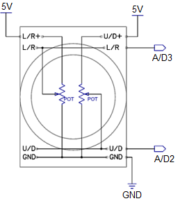

# Analog to Digital Converter (ADC)

First, make sure SPI is enabled (you can also use `raspi-config`)
```
$ sudo raspi-config nonint do_spi 0
```

## MCP3008 - SPI 8 channel ADC
Good doc at <https://randomnerdtutorials.com/raspberry-pi-analog-inputs-python-mcp3008/>

> Something to notice:  
> In C (or Java, or others), the values returned when reading a channel from the MCP3008 are in `[0..1023]`. The MCP3008 is a 10-bit device, and `2^10 = 1024`.  
> Here - in the Python code - the values are in `[0..1]`.  
> Something not to forget.

### MCP3008 pin numbering


| Pin | Symbol | Description |
|:---:|:------:|:------------|
| 1 | CH0 | Analog input (channel 0) |
| 2 | CH1 | Analog input (channel 1) | 
| 3 | CH2 | Analog input (channel 2) | 
| 4 | CH3 | Analog input (channel 3) | 
| 5 | CH4 | Analog input (channel 4) | 
| 6 | CH5 | Analog input (channel 5) | 
| 7 | CH6 | Analog input (channel 6) | 
| 8 | CH7 | Analog input (channel 7) | 
| 9 | DGND | Digital ground | 
| 10 | CS/SHDN | Chip select/shutdown pin | 
| 11 | Din | Serial data in | 
| 12 | Dout | Serial data out | 
| 13 | CLK | Serial clock | 
| 14 | AGND | Analog ground | 
| 15 | VRef | Reference voltage input | 
| 16 | VDD | +2.7V to 5.5V power supply |

### With a potentiometer only


#### Wiring Raspberry Pi - MCP3008
| MCP3008 | Raspberry Pi |
|:-------:|:------------:|
|  #16    | #1 - 3.3V    |
|  #15    | #1 - 3.3V    |
|  #14    | #6 - GND     |
|  #13    | #23 - SCLK   |
|  #12    | #21 - MISO   |
|  #11    | #19 - MOSI   |
|  #10    | #24 - CE0    |
|  #9     | #6 - GND     |

Using MCP3008 Channel 0 (pin #1)

Then run 
```
$ python3 pot.MCP3008.py
```

### With a potentiometer _AND_ a led (PWM powered)


Make sure the `LED_PIN` is set correctly in the code (`pot.led.MCP3008.py`).  
Then run 
```
$ python3 pot.led.MCP3008.py
```
The led will glow, according to the value of the potentiometer.

## MCP3002 - SPI 2 channel ADC
See this: <https://learn.sparkfun.com/tutorials/python-programming-tutorial-getting-started-with-the-raspberry-pi/experiment-3-spi-and-analog-input>

- MCP3002 Datasheet [here](https://www.farnell.com/datasheets/1599363.pdf), and [here](https://ww1.microchip.com/downloads/en/DeviceDoc/21294E.pdf)

> TODO: Wiring, Code...

## Joystick
A Joystick has two potentiometers, one for Up/Down, one for Left/Right.
- <https://www.adafruit.com/product/245>
- <https://learn.parallax.com/support/reference/propeller-blocklyprop-block-reference/sensor/2-axis-joystick/joystick-wiring>



#### Wiring
- The wiring of the MCP3008 remains the same as above
- For the joystick:
    - Joystick's `5V` (the **_two_** connections) goes to the Raspberry's `3.3V` 
    - Joystick's `GND` goes to the Raspberry's `GND`
    - `A/D3` (L/R, left or right) goes to the MCP3008's `CH1`
    - `A/D2` (U/D, left or right) goes to the MCP3008's `CH0`

#### Raw / Basic test
Run
```
$ python3 joystick.MCP3008.py
```
and move the joystick. You'd get an output like this:
```
Up-Down    value: 0.49682462139716654
Left-Right value: 0.5007327796775769
Up-Down    value: 0.4303859306301905
Up-Down    value: 0.3082559843673669
Up-Down    value: 0.4978016609672691
Up-Down    value: 0.9589643380556911
Up-Down    value: 0.0004885197850512668
Left-Right value: 0.0004885197850512668
Up-Down    value: 0.7616023448949683
Left-Right value: 0.5017098192476794
Up-Down    value: 0.4978016609672691
Up-Down    value: 0.4284318514899854
Up-Down    value: 0.23009281875915977
Up-Down    value: 0.4978016609672691
Up-Down    value: 0.4978016609672691
Up-Down    value: 0.4978016609672691
Up-Down    value: 0.0004885197850512668
Left-Right value: 0.0004885197850512668
. . .
```

### Joystick driving a camera pan-tilt stand
- Camera pan-tilt stand is usually made of two linear servos,
  like [this one](https://www.adafruit.com/product/1967).

We'll use a MPC3008 to get the values on the joystick potentiometer, and PWM to drive the servos of the pan-tilt stand.

---
