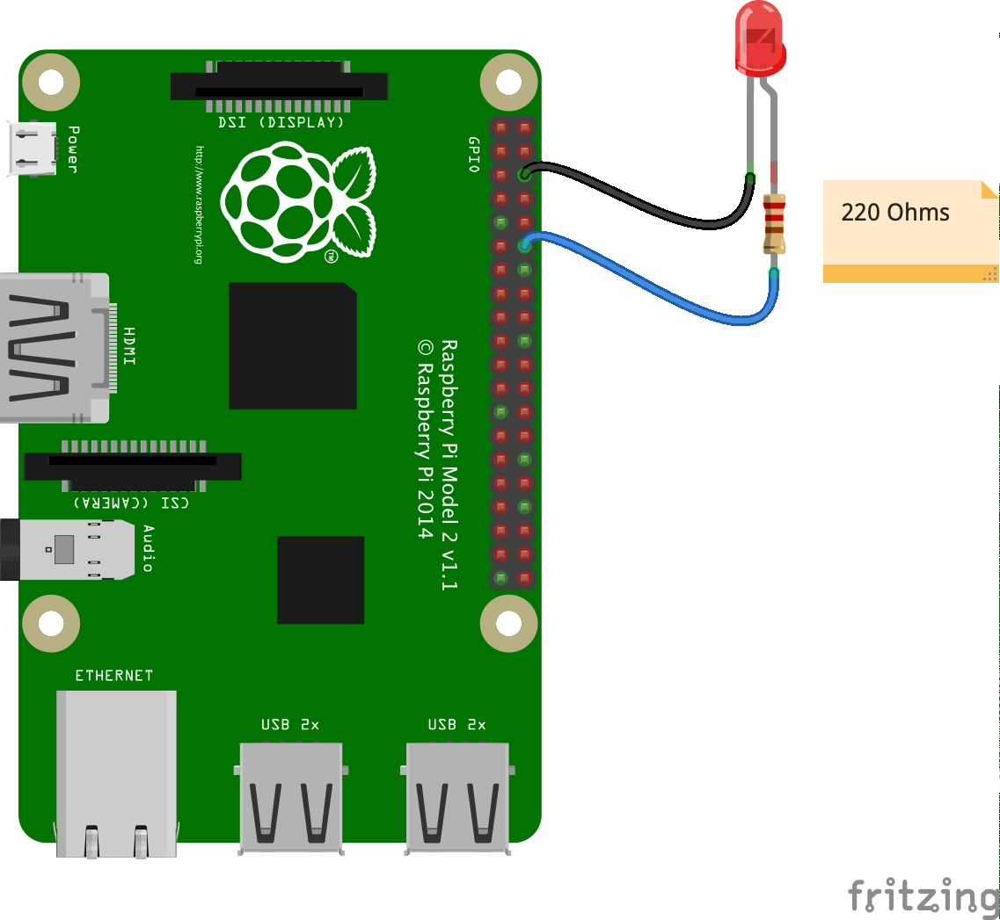

# Pulse Width Modulation (aka PWM)

- See [this](https://passe-coque.com/admin/sql/index.html).



- The resistor is a 220 &Omega; one. **DO NOT OMIT THE RESISTOR!**. Or you could get a new Raspberry Pi.
- The physical pin #6 is the `GND` one
- The physical pin #12 is also named `GPIO18`

To see the led glow up and down, run:
```
$ python3 pwm.101.py
```
`Ctrl-C` will stop the program.

---
