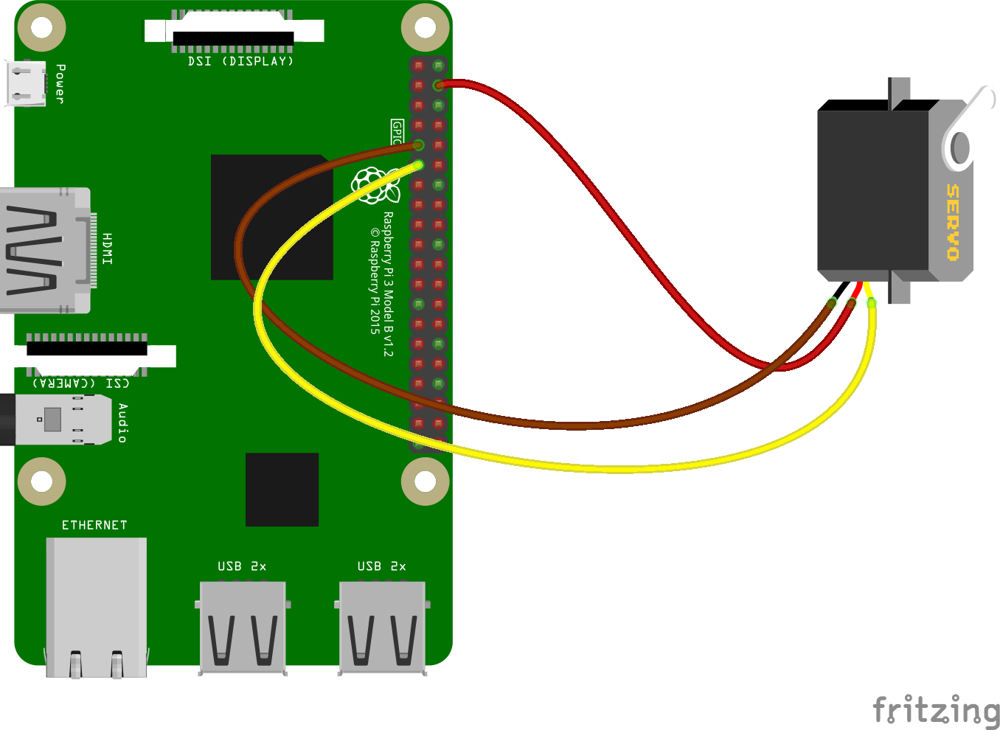

# Pulse Width Modulation (aka PWM)

- See [this](https://passe-coque.com/admin/sql/index.html).


- The resistor is a 220 &Omega; one. **DO NOT OMIT THE RESISTOR**!   
Or you could get yourself a new Raspberry Pi.
- The physical pin #6 is the `GND` one
- The physical pin #12 is also named `GPIO18`

To see the led glow up and down, run:
```
$ python3 pwm.01.py
```
`Ctrl-C` will stop the program.

Also try (works the same, with other Python modules)
```
$ python3 pwm.02.py
```

**_Warning_**: all the leds are not the same... I've had wierd blinkings with some (with the exact same setting).

## Servos and PWM
See this <https://www.learnrobotics.org/blog/raspberry-pi-servo-motor/>  

### A simple test, one servo
We will be using phisical pin #11, aka `GPIO17`. See in the code.  
This will take 3 diffreent positions (0&deg;, 90&deg;, and 135&deg;), twice, and the park the servo at 90&deg;.

Wiring:  


Basic test: run 
```
$ python3 pwm.servo.01.py
set to 0-deg
set to 90-deg
set to 135-deg
set to 0-deg
set to 90-deg
set to 135-deg
Parking to 90-deg
$ 
```

For an interactice CLI UI:
```
$ python3 pwm.servo.02.py 
Initializing servo at 90-deg
-- Ready. Enter the servo angle when prompted (Q to exit).
Servo Angle [0..180] (Q to exit): 0
setting servo to 0
Servo Angle [0..180] (Q to exit): 1809
Value between 0 and 180, please. Not 1809.
Servo Angle [0..180] (Q to exit): 180
setting servo to 180
Servo Angle [0..180] (Q to exit): 170
setting servo to 170
Servo Angle [0..180] (Q to exit): 160
setting servo to 160
Servo Angle [0..180] (Q to exit): 80
setting servo to 80
Servo Angle [0..180] (Q to exit): q
Exiting at user's request
Exiting the loop
Parking at 90-deg
Bye!
$
```

---
